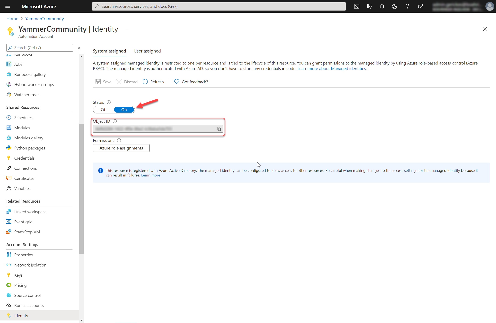
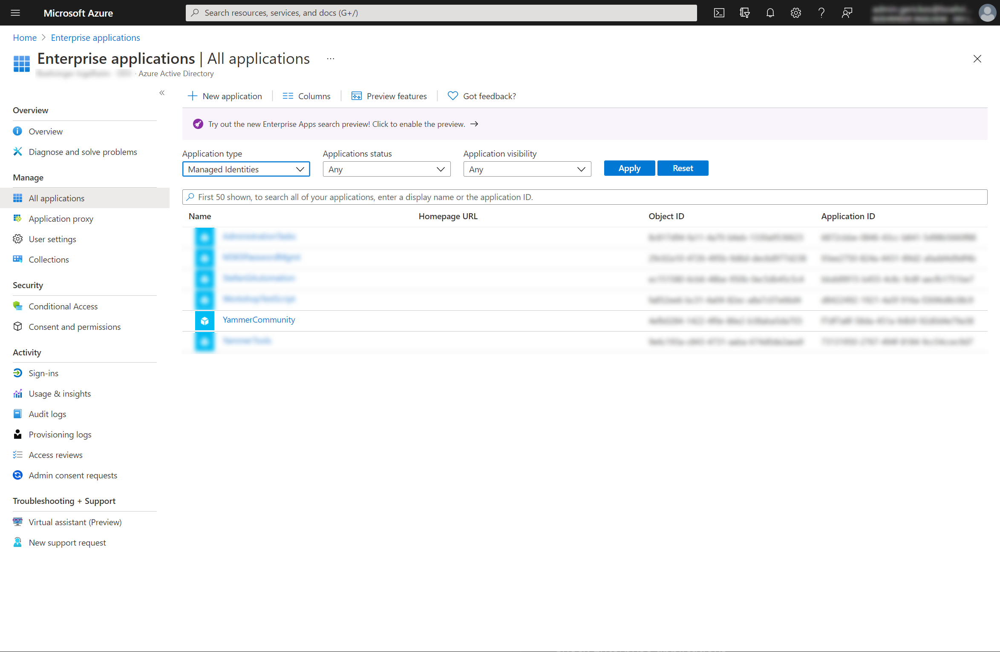
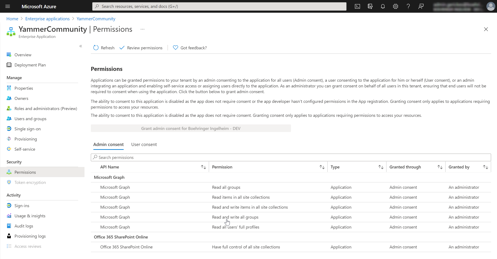

# Managed Identity with Azure Automation and Graph API

This will be a small tutorial how to create the **Managed Identity** for Azure Automation and how to use this identity for example to connect to Graph API. This will helps you to do administrative tasks with sending request to the API endpoints of Microsoft.

You can manage only **application permission** foryour Graph API endpoints, **delegated permission** are not possible.

## Prerequisites

- Resource Group in your Azure Portal
- Automation Account in your Resource Group to create your *Runbook* with PowerShell

## Enable Managed Identity in Azure portal

1. Sign in to the Azure Portal and go to the [Resource Group](https://portal.azure.com/#blade/HubsExtension/BrowseResourceGroups) where your Automation Account is located.
2. Select **Identity** under **Account Settings**.
3. Switch in **System assigned** the **Status** to **On** and press **Save**. Please confirm the prompt.

Your Automation Account can now use the created identity, which is registered in Azure AD. Please copy the now assigned **Object ID**, you will need this later to grant the permission.



## Grant privileges to Managed Identity

To grant the permission you need for your Azure Automation you have to run the following PowerShell script on your local workstation. By running this script a prompt will apear to ask for your Azure AD credentials. To grant the permission you need administrative permission e.g. **Global Administrator**.

To assign the granted permission to the correct **Managed Identity** please paste the **Obkect ID** in the second line of this script.

In this case you will grant the following permission to the **Managed Identity**:

- Graph API
  - User.Read.All
  - Group.Read.All
  - Group.ReadWrite.All
  - Sites.Read.All
  - Sites.ReadWrite.All
- SharePoint Online
  - Sites.FullControl.All

Please grant only this permission to the Managed Identity you only need to run your **Runbook** in your Azure Automation.

``` PowerShell
# Object Id of the managed identity
$ObjIdDev =  "<object id of the managed identity>"

$PermissionMap = @{
    '00000003-0000-0000-c000-000000000000' = @( # Microsoft Graph
        'User.Read.All'
        'Group.Read.All'
        'Group.ReadWrite.All'
        'Sites.Read.All'
        'Sites.ReadWrite.All'
    )
    '00000003-0000-0ff1-ce00-000000000000' = @( # Office 365 SharePoint Online
        'Sites.FullControl.All'
    )
}

Connect-AzureAD

# Get Service Principal using ObjectId
$ManagedIdentity = Get-AzureADServicePrincipal -ObjectId $ObjIdDev

Get-AzureADServicePrincipal -All $true | Where-Object { $_.AppId -in $PermissionMap.Keys} -PipelineVariable SP | ForEach-Object {

    $SP.AppRoles | Where-Object { $_.Value -in $PermissionMap[$SP.AppId] -and $_.AllowedMemberTypes -contains "Application" } -PipelineVariable AppRole | ForEach-Object {
        try {
            New-AzureAdServiceAppRoleAssignment -ObjectId $ManagedIdentity.ObjectId `
                                            -PrincipalId $ManagedIdentity.ObjectId `
                                            -ResourceId $SP.ObjectId `
                                            -Id $_.Id `
                                            -ErrorAction Stop
        } catch [Microsoft.Open.AzureAD16.Client.ApiException] {
            if ($_.Exception.Message -like '*Permission being assigned already exists on the object*') {
                'Permission {0} already set on {1}.' -f $AppRole.Value, $SP.DisplayName | Write-Warning
            } else {
                throw $_.Exception
            }
        }
    }
}
```

## Check Enterprise applications

In **Enterprise applications** you can check your new created **Managed Identity**.

1. Please navigate to [Enterprise applications](https://portal.azure.com/#blade/Microsoft_AAD_IAM/StartboardApplicationsMenuBlade/AllApps) in Azure Portal.
2. Switch the dropdown in **Aplication type** to **Managed Identities** and confirm the selection with the **Apply** button. 
3. Open your **Managed Identity** and navigate to **Permission** under **Security**. 

All requested API permission for this **Managed Identity** should be listed in **Admin consent**.

## Generate an access token for Graph API

In your **Runbook** of your Azure Automation I've implement the following function to get my access token of Microsoft Graph API:

``` PowerShell
function Get-GraphAPIAccessToken {
    $resource= "?resource=https://graph.microsoft.com/"
    $url = $env:IDENTITY_ENDPOINT + $resource
    $Headers = New-Object "System.Collections.Generic.Dictionary[[String],[String]]"
    $Headers.Add("X-IDENTITY-HEADER", $env:IDENTITY_HEADER)
    $Headers.Add("Metadata", "True")
    $accessToken = Invoke-RestMethod -Uri $url -Method 'GET' -Headers $Headers
    return $accessToken.access_token
}
```

With this access token you can build your header to do your web request against Graph API:

``` PowerShell
# Get access token for Graph API
$graphApiToken = Get-GraphAPIAccessToken

# Create header for using Graph API
$graphApiHeader = @{ Authorization = "Bearer $graphApiToken" }

# Example web request
$webRequest = Invoke-RestMethod -Headers $graphApiHeader -Uri "https://graph.microsoft.com/v1.0/me" -Method Get -ContentType "application/json"
```

## Reference

- Microsoft Docs: [Enable a managed identity for your Azure Automation account (preview)](https://docs.microsoft.com/en-us/azure/automation/enable-managed-identity-for-automation#authenticate-access-with-managed-identity)
- Microsoft Docs: [Azure Automation account authentication overview - Managed identities (preview)](https://docs.microsoft.com/en-us/azure/automation/automation-security-overview#managed-identities-preview)